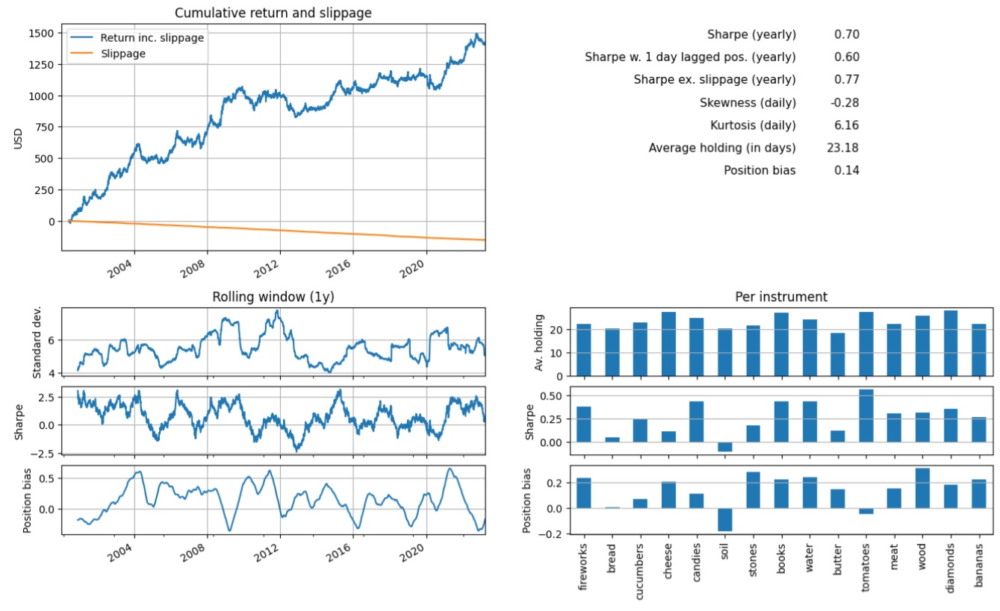
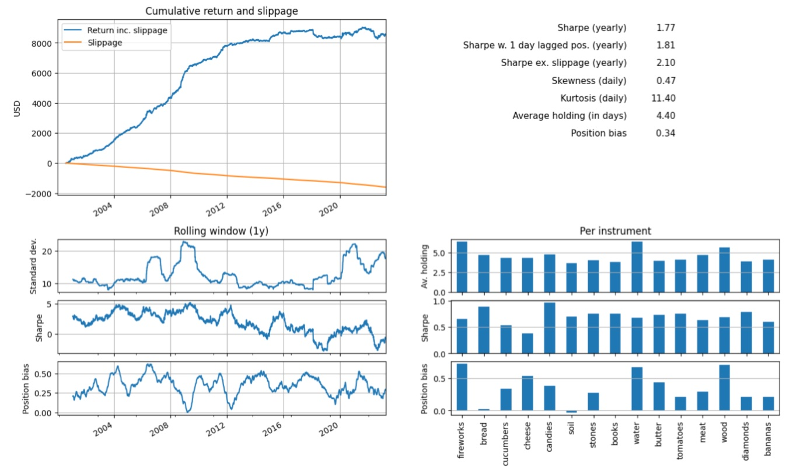
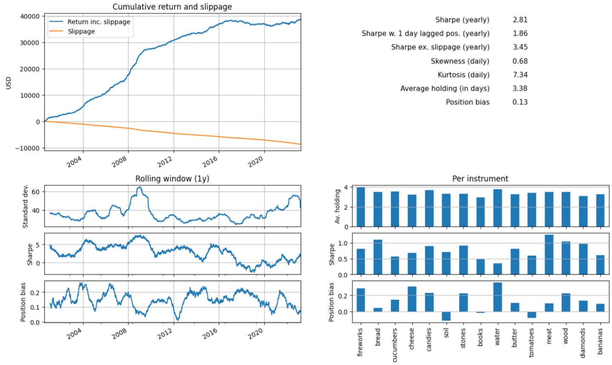

# Lynx Hedge Hackathon 2023: Team Värnhems Väktare

Repo for Team Värnhems Väktare during the hackathon hosted by Lynx Asset Management, April 1 2023. 

The task is to come up with the best systematic strategy for building portfolios for commodity futures, given historical prices. The teams
are evaluated based on average Sharpe Ratio, among other things (such as kurtosis), over a held-out test set. 


## Results 

Unfortunately, we ended up at 4th position in the tournament. 

| Submission                                                                                             | Avg. Sharpe Ratio (test set) |
|--------------------------------------------------------------------------------------------------------|------------------------------|
| Baseline (provided by Lynx)                                                                            | 0.70                         |
| Our submission on the day                                                                              | 1.77                         |
| Our submission after implementing the strategy we intended, after hackathon (required another 2 hours) | 2.81                         |

## Strategies

### Baseline 

This is an overview of the score of the baseline.



### What we handed in

We used an extremely simple approach on the hackathon day, due to lack of time. What is presented next is not what we intended to implement, 
but it was our last resort. 

We had a canonical two-component pipeline consisting of a 1) trend model
and 2) a risk model. The trend model was a learnt linear predictor of the future 6 days' cumulative return, given past returns. The risk model
assumed all asset returns were independent (!) and computed asset return volatilities as the historical rolling (125-day, half trading year) 
standard std measure. The final positions every day were the predicted 6-day returns divided by the volatilities, for each asset.

This is some summaries of our performance. 



This (not shockingly) did not make us win the hackathon. However, we had some more sophisticated ideas we wanted to try out, but which we
did not entirely have time to implement during the event. We did though implement it after the event, leading to a large improvement in final 
system performance, as presented in the following.

### A more sophisticated approach (required another 2 hours of implementation)

Our original plan was the following. Once more, we use a trend model and a risk model. Additionally, we have an optimization component in the end 
of the pipeline whose goal is to optimize the portfolio weights.

#### Trend model 
The trend model is again a learnt linear predictor of future accumulated windowed returns (10 days), given past returns. 
This model is trained on the training data.

#### Risk model 
We use rolling window (half a trading year) return covariance matrices with learnt linear shrinkage to get better covariance estimates. 

#### Optimization component
Every day, we recompute the positions of each asset in the portfolio such that the portfolio maximizes the Sharpe ratio
(account for slippage). Formally, we do the following. 

Assume there exists $k$ assets. We want to choose our positions (portfolio weights) $w = (w_1, w_2, ..., w_k)$ such that the Sharpe ratio is 
minimized in each time step, given a predicted future 6-day return and a predicted covariance matrix. Thus, we seek to solve

$w_t = \mathrm{argmin}_{w \in \mathbb{R}^k} \frac{r_{t,6}^\top w}{\sqrt{w^\top \hat{\Sigma}_{t} w}}$.

where $r_{t,6}$ is the predicted 6-day return at day $t$, and $\hat{\Sigma}_{t}$ the predicted covariance matrix at time $t$ with linear shrinkage.
We solve this by numerical optimization. Note that there is no independence assumption on the joint asset returns. 

#### Modification 

**$L1$ to $L2$ slippage.** We do some modifications to this initial formulation. First, we account for transaction costs (slippage) by including in the objective function 
a negative term proportional to yesterday's total absolute changes in positions. Although we predict medium-term returns (not just the next day), we still
experienced very large modifications in our portfolio every day when running this strategy. To smoothen out the portfolio position curve, to limit slippage, 
we changed the transaction term from $L1$ norm into $L2$ to limit any larger and rapid changes in the portfolio. This dramatically improved our pipeline.

**Skipping position updates.** We additionally found improvements when not updating our positions every other day. By grid search we found skipping to 
update positions every 3rd day actually improves our result. We believe this works because it adds even more inertia to our portfolio distribution, something 
which is required if you want to optimize it over some strict objective every day. 

**Optimizer initialization**. First, we initialized the positions in the optimizer (every day) with a random number in [-1, 1] for each asset. We saw drastic 
improvements when instead initializing for each asset the optimizer positions with the previous day's positions.

**Adding more friction in the portfolio.** To add even more friction to the daily changes in positions, we scaled the slippage term in the objective 
function by another factor of 10. This improved our results slightly. However, an even better scaling value can probably be found. 

#### Final results

These are the results with the more sophisticated pipeline. The return curve is significantly smoother than our previous submissions, and has
a larger average Sharpe ratio. The kurtosis has been improved compared to our original submission -- however it's greater than that of the baseline.    



## How to run

After cloning, run 

```bash
python3 -m venv venv
source venv/bin/activate
python3 -m pip install -r requirements.txt
```

and execute the pipeline with 

```bash
python3 main.py 
```

 Particularly, you can configure an experiment run in `main.py` to 
generate the same results as we did.

If you'd like to play around in jupyter lab, run

```bash
python3 -m ipykernel install --user --name hackathon
jupyter lab .
```